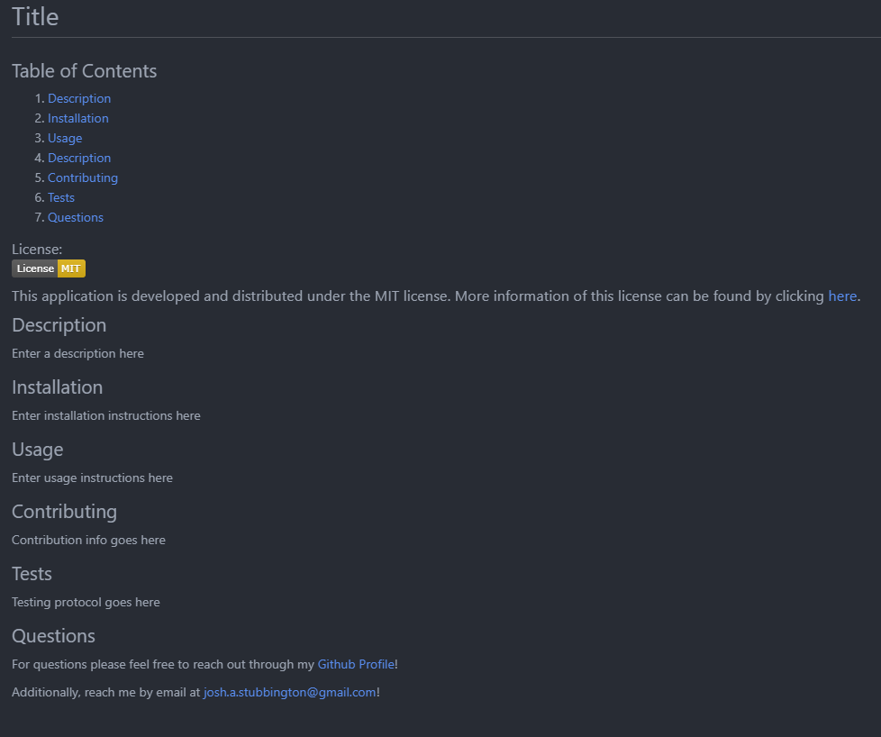

  # README Generator
  
  ## Description
  This is a Node.js based application that can be used to easily create a markdown README file for any application. This application uses the Node.js library Inquirer to prompt the user. The user's responses are then used to generate the README file with corresponding sections. These sections include a description, license information, installation instructions, usage instructions, information regarding contribution, test protocols and lastly a section for sending questions directly to the lead developer with a link to thier user's Github profile. The generated file also contains a Table of Contents with links to the subsections of the document.

  Here is a demo of the application:

   
   
   
  Here is a screenshot of the README generated by the demo: 
   
  

  For reference, here is a short video demonstrating the application: [Video Demonstration](https://youtu.be/H44fC4i5ayM)

 
  